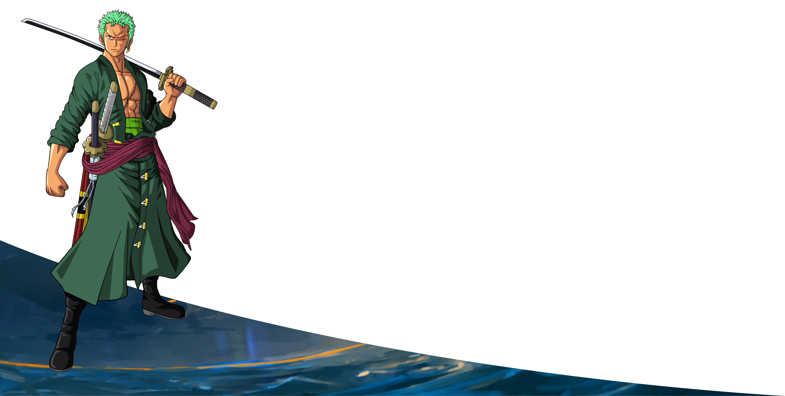

	

	

<h2>Olá Devs! 🖐</h2>

  

- Desenvolvedor Python 🐍
- Atualmente trabalho na Suridata Tecnologia
- Estou estudando C#
- Me divertindo bastante com Unity

	

&nbsp;&nbsp;&nbsp;&nbsp;&nbsp;
&nbsp;
&nbsp;
&nbsp;
&nbsp;
&nbsp;
&nbsp;
&nbsp;
&nbsp;
&nbsp;

	

	

